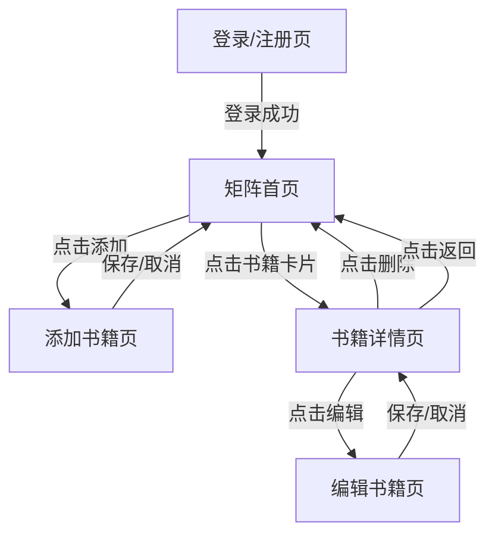
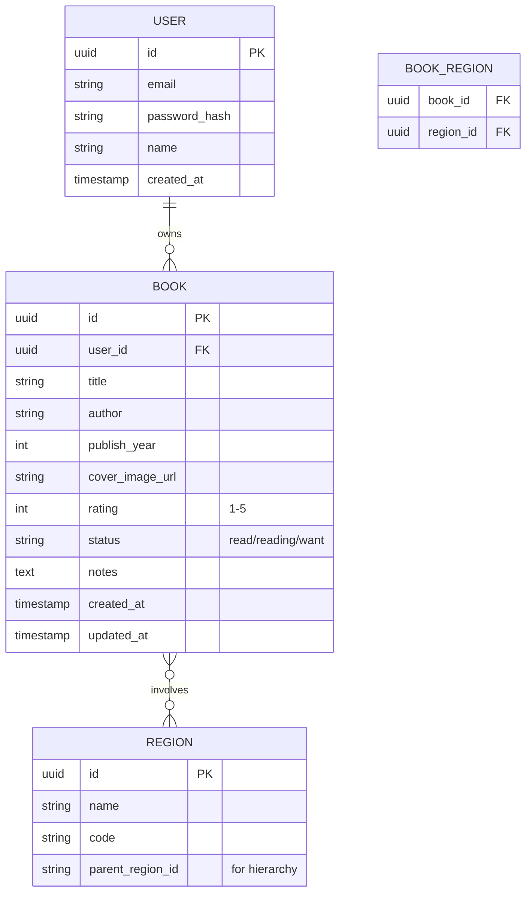

# 历史阅读网站 - 产品需求文档

## 1. 产品概述

历史阅读网站是一个可视化历史书籍管理工具，通过矩阵式布局帮助用户按时间和地理维度整理阅读过的历史书籍。

* 核心目标：让用户以直观的时间-地理坐标方式管理和回顾历史阅读历程

* 目标用户：历史爱好者、学生、研究者

* 产品价值：将零散的历史阅读转化为可视化的知识图谱，帮助用户建立历史时空观

## 2. 核心功能

### 2.1 用户角色

| 角色   | 注册方式    | 核心权限            |
| ---- | ------- | --------------- |
| 普通用户 | 邮箱注册/登录 | 管理自己的书籍，浏览时间轴矩阵 |

### 2.2 功能模块

历史阅读网站包含以下主要页面：

1. **首页/时间轴矩阵页**：核心功能页面，展示时间-地理矩阵，支持缩放和书籍展示
2. **书籍详情页**：展示单本书籍的详细信息
3. **添加/编辑书籍页**：表单页面，用于新增或编辑书籍信息
4. **登录/注册页**：用户认证页面

### 2.3 页面详情

| 页面名称   | 模块名称    | 功能描述                                                                                |
| ------ | ------- | ----------------------------------------------------------------------------------- |
| 首页/矩阵页 | 时间轴缩放控制 | 提供缩放按钮（放大/缩小/重置）和滑块，支持鼠标滚轮缩放，缩放范围从年到世纪级别                                            |
| 首页/矩阵页 | 时间轴横向区域 | 显示时间刻度，支持拖拽平移，当前视图时间范围实时显示                                                          |
| 首页/矩阵页 | 地理纵向区域  | 显示国家/地区列表，支持折叠/展开，固定显示在左侧                                                           |
| 首页/矩阵页 | 书籍卡片矩阵  | 在时间-地理交叉位置显示书籍卡片，卡片显示书名、作者、封面缩略图                                                    |
| 首页/矩阵页 | 添加书籍按钮  | 浮动按钮，点击后弹出添加书籍表单或跳转添加页面                                                             |
| 首页/矩阵页 | 书籍卡片交互  | 悬停显示书籍基本信息，点击打开书籍详情页                                                                |
| 书籍详情页  | 书籍信息展示  | 显示书籍封面、书名、作者、出版年份、涉及国家/地区、个人评分、阅读状态、简介、读书笔记                                         |
| 书籍详情页  | 编辑按钮    | 点击后进入编辑模式，可修改书籍信息                                                                   |
| 书籍详情页  | 删除按钮    | 删除确认后移除书籍                                                                           |
| 书籍详情页  | 返回按钮    | 返回矩阵首页                                                                              |
| 添加/编辑页 | 书籍表单    | 包含字段：书名（必填）、作者（必填）、出版年份（必填）、涉及国家/地区（多选）、封面图片（上传/URL）、个人评分（1-5星）、阅读状态（已读/在读/想读）、个人笔记 |
| 添加/编辑页 | 保存/取消按钮 | 保存书籍信息或取消操作                                                                         |
| 登录/注册页 | 登录表单    | 邮箱、密码输入，记住我选项                                                                       |
| 登录/注册页 | 注册表单    | 邮箱、密码、确认密码输入                                                                        |

## 3. 核心流程

### 3.1 用户操作流程

**新用户流程**：

1. 访问网站 → 进入登录页
2. 点击注册 → 填写邮箱密码 → 完成注册
3. 自动登录 → 进入空白矩阵首页
4. 在对应的时间和地理位置的地方，点击添加书籍 → 填写书籍信息 → 保存
5. 书籍出现在矩阵对应位置
6. 点击书籍 → 查看详情 → 可编辑或删除

**老用户流程**：

1. 登录 → 进入矩阵首页，显示已添加的书籍
2. 使用时间轴缩放控件调整时间范围
3. 拖拽时间轴浏览不同时期
4. 点击书籍查看详情或编辑
5. 继续添加新书籍

### 3.2 页面导航流程图



## 4. 用户界面设计

### 4.1 设计风格（参考 Al Murphy）

参考 [Al Murphy](https://godly.website/website/al-murphy-468) 的活泼、趣味、插画风格，将历史阅读变得轻松有趣：

* **主色调**：
  - 背景：柔和的奶油色 `#FFF8F0` 或淡粉色 `#FFE4E1`
  - 主色：温暖的珊瑚色 `#FF6B6B`、薄荷绿 `#4ECDC4`、柔和紫 `#9B59B6`
  - 点缀：明亮的黄色 `#FFD93D`、天蓝色 `#74B9FF`

* **视觉风格**：
  - 活泼的插画元素：书籍、地球、时钟等手绘风格图标
  - 圆润的形状：大圆角按钮、卡片、输入框
  - 丰富的渐变：柔和的粉彩渐变背景
  - 有趣的动画：微交互、弹性动画、滚动视差效果

* **字体**：
  - 标题：圆润友好的无衬线字体（如 Nunito、Quicksand）
  - 正文：清晰易读的无衬线字体（如 Inter）

* **布局风格**：
  - 矩阵网格布局，但使用柔和的分隔线而非生硬边框
  - 左侧地理栏使用彩色标签区分不同地区
  - 时间轴采用渐变色彩区分不同时期
  - 充足的留白，呼吸感强

* **书籍卡片设计**：
  - 彩色边框或阴影，每本书有独特的颜色标识
  - 封面图圆角处理，带轻微悬浮效果
  - 悬停时有趣的弹性动画

### 4.2 页面设计概述

| 页面名称   | 模块名称   | UI元素                                        |
| ------ | ------ | ------------------------------------------- |
| 矩阵首页   | 顶部导航栏  | 网站Logo（左侧）、用户信息/退出（右侧）、固定高度60px，深褐色背景       |
| 矩阵首页   | 时间轴控制区 | 位于导航栏下方，包含缩放按钮组（+/-/重置）、时间范围显示、滑块，高度50px    |
| 矩阵首页   | 地理侧边栏  | 固定宽度200px，左侧固定，显示国家/地区列表，可滚动，每项高度40px，交替背景色 |
| 矩阵首页   | 矩阵内容区  | 主内容区域，横向时间轴刻度在上，网格线显示，书籍卡片定位在对应坐标           |
| 矩阵首页   | 书籍卡片   | 宽度160px，高度200px，圆角8px，白色背景，阴影效果，显示封面图、书名、作者 |
| 矩阵首页   | 浮动添加按钮 | 右下角固定，圆形，直径56px，金色背景，白色+图标                  |
| 书籍详情页  | 页面布局   | 两栏布局，左侧书籍封面（占40%），右侧信息（占60%），最大宽度1200px居中   |
| 书籍详情页  | 封面展示   | 大尺寸封面图，圆角12px，阴影效果                          |
| 书籍详情页  | 信息区域   | 书名（大标题）、作者（副标题）、元数据（网格排列）、评分（星星图标）、简介（正文）   |
| 书籍详情页  | 操作按钮   | 编辑（主按钮）、删除（危险色按钮），位于信息区域底部                  |
| 添加/编辑页 | 表单布局   | 单栏布局，最大宽度600px居中，分组显示字段                     |
| 添加/编辑页 | 表单字段   | 标签在上，输入框在下，必填项标记红色\*，多选使用标签式选择器             |
| 添加/编辑页 | 底部操作   | 保存（主按钮）、取消（次按钮），固定在表单底部                     |

### 4.3 响应式设计

* **桌面优先**：主要面向桌面端用户，提供完整的矩阵浏览体验

* **平板适配**：时间轴和地理栏可折叠，矩阵区域自适应宽度

* **移动端简化**：矩阵改为列表视图，按时间或地区筛选浏览

### 4.4 交互细节

* **时间轴缩放**：鼠标滚轮缩放时以鼠标位置为中心，平滑动画过渡

* **拖拽平移**：按住鼠标拖拽可平移时间轴，光标变为抓取状态

* **书籍卡片悬停**：轻微放大（scale 1.05），阴影加深，显示快速操作按钮

* **添加书籍**：支持点击矩阵空白处快速添加（自动填充时间/地区）

## 5. 数据结构

### 5.1 核心数据模型



### 5.2 数据定义

**用户表 (users)**

```sql
CREATE TABLE users (
    id UUID PRIMARY KEY DEFAULT gen_random_uuid(),
    email VARCHAR(255) UNIQUE NOT NULL,
    password_hash VARCHAR(255) NOT NULL,
    name VARCHAR(100) NOT NULL,
    created_at TIMESTAMP WITH TIME ZONE DEFAULT NOW()
);
```

**书籍表 (books)**

```sql
CREATE TABLE books (
    id UUID PRIMARY KEY DEFAULT gen_random_uuid(),
    user_id UUID NOT NULL REFERENCES users(id) ON DELETE CASCADE,
    title VARCHAR(255) NOT NULL,
    author VARCHAR(255) NOT NULL,
    publish_year INTEGER NOT NULL,
    cover_image_url TEXT,
    rating INTEGER CHECK (rating >= 1 AND rating <= 5),
    status VARCHAR(20) CHECK (status IN ('read', 'reading', 'want')),
    notes TEXT,
    created_at TIMESTAMP WITH TIME ZONE DEFAULT NOW(),
    updated_at TIMESTAMP WITH TIME ZONE DEFAULT NOW()
);

CREATE INDEX idx_books_user_id ON books(user_id);
CREATE INDEX idx_books_publish_year ON books(publish_year);
```

**地区表 (regions)**

```sql
CREATE TABLE regions (
    id UUID PRIMARY KEY DEFAULT gen_random_uuid(),
    name VARCHAR(100) NOT NULL,
    code VARCHAR(10) UNIQUE NOT NULL,
    parent_region_id UUID REFERENCES regions(id),
    display_order INTEGER DEFAULT 0
);

CREATE INDEX idx_regions_parent ON regions(parent_region_id);
```

**书籍-地区关联表 (book\_regions)**

```sql
CREATE TABLE book_regions (
    book_id UUID REFERENCES books(id) ON DELETE CASCADE,
    region_id UUID REFERENCES regions(id) ON DELETE CASCADE,
    PRIMARY KEY (book_id, region_id)
);

CREATE INDEX idx_book_regions_book ON book_regions(book_id);
CREATE INDEX idx_book_regions_region ON book_regions(region_id);
```

### 5.3 初始地区数据

```sql
-- 主要地区
INSERT INTO regions (name, code, display_order) VALUES
('中国', 'CN', 1),
('日本', 'JP', 2),
('欧洲', 'EU', 3),
('美国', 'US', 4),
('中东', 'ME', 5),
('非洲', 'AF', 6),
('南亚', 'SA', 7),
('东南亚', 'SEA', 8),
('俄罗斯/苏联', 'RU', 9),
('拉丁美洲', 'LAT', 10);

-- 欧洲子地区
INSERT INTO regions (name, code, parent_region_id, display_order) VALUES
('英国', 'UK', (SELECT id FROM regions WHERE code='EU'), 1),
('法国', 'FR', (SELECT id FROM regions WHERE code='EU'), 2),
('德国', 'DE', (SELECT id FROM regions WHERE code='EU'), 3),
('意大利', 'IT', (SELECT id FROM regions WHERE code='EU'), 4);
```

## 6. 技术要点

### 6.1 时间轴缩放算法

* 支持多级缩放：年(1年/格) → 五年 → 十年 → 世纪 → 千年

* 缩放时保持当前中心时间点不变

* 平滑动画过渡，使用 CSS transform

### 6.2 矩阵定位计算

* 每本书在矩阵中的 X 坐标由 publish\_year 映射到像素位置

* Y 坐标由第一个关联地区在地区列表中的索引决定

* 同一坐标有多本书时，水平排列或堆叠显示

### 6.3 性能优化

* 虚拟滚动：只渲染可视区域内的书籍卡片

* 图片懒加载：书籍封面按需加载

* 数据分页：时间轴范围过大时，按页加载书籍数据

